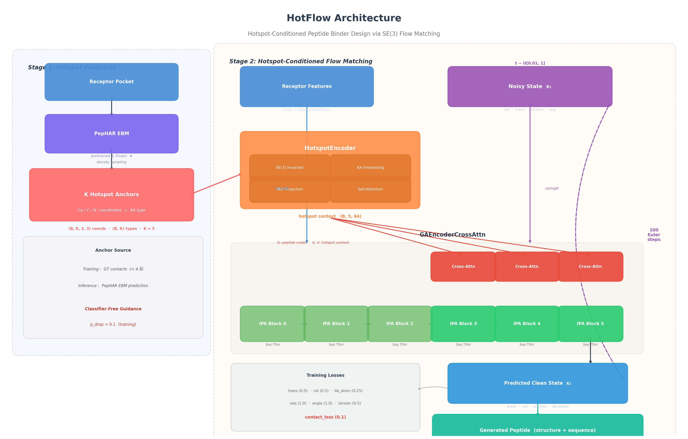

# HotFlow

**Hotspot-driven full-atom peptide binder design with SE(3) flow matching.**

HotFlow is a two-stage framework for structure-based peptide binder design. An
energy-based model identifies the binding hotspots a peptide should occupy on a
receptor surface; a flow matching network then generates the full-atom peptide
structure and sequence conditioned on those hotspots.

It combines two published methods:

- **[PepHAR](https://github.com/Ced3-han/PepHAR)** (ICLR 2025) predicts hotspot
  residue densities on the receptor surface and grows peptides by autoregressive
  fragment extension. Strong interface quality, but sequential placement
  introduces steric clashes — later fragments cannot see the global geometry.
- **[PepFlow](https://github.com/Ced3-han/PepFlowww)** (ICML 2024) generates
  full-atom peptides non-autoregressively with multi-modal flow matching on
  SE(3) × torus. Globally consistent conformations, but it treats all receptor
  surface residues uniformly and has no notion of which ones matter for binding.

HotFlow keeps PepHAR's hotspot awareness and PepFlow's global consistency by
using the former as a frozen conditioning signal for the latter.



> **Status.** This is research code from a course project, released as a record
> of the work. The components below are implemented and carry unit tests, which
> were last run during development. Evaluation is **not** complete: the first test
> set run used ground-truth-derived anchors at inference time, which does not
> match the intended de novo protocol, and the corrected run has not been
> finished. **No benchmark numbers are reported here for that reason.** See
> [Evaluation status](#evaluation-status).

---

## Approaches

The repository implements three ways to combine the two models, plus the two
baselines.

### Approach B — cross-attention conditioning (the main method)

```
Stage 1   receptor pocket
              │
              ▼
          PepHAR EBM density model  (frozen, pretrained)
              │
              ▼
          K hotspot anchors  —  CA/C/N coordinates + amino-acid type
              │
Stage 2       ▼
          HotspotEncoder  →  anchor context  (B, K, d_hotspot)
              │
              ▼
          cross-attention injected into PepFlow IPA encoder blocks 3/4/5
              │
              ▼
          peptide nodes attend to the anchor context
              │
              ▼
          conditioned structure + sequence generation
```

Only the cross-attention layers and the `HotspotEncoder` are trained; PepHAR
stays frozen, and PepFlow is initialised from its pretrained weights. Hotspot
context is dropped with p = 0.1 during training so that classifier-free guidance
is available at sampling time (`--guidance_scales`).

Implemented in [`hotflow/models/flow_model_b.py`](hotflow/models/flow_model_b.py),
[`hotflow/models/hotspot_encoder.py`](hotflow/models/hotspot_encoder.py) and
[`hotflow/models/ga_encoder_crossattn.py`](hotflow/models/ga_encoder_crossattn.py).

### Approach A — inpainting (ablation baseline)

PepHAR predicts the anchors, K peptide residues are frozen at those positions,
and a pretrained PepFlow fills in the remaining L−K residues. A hard constraint
with no learned conditioning and no training step — every module is pretrained.

Implemented in [`hotflow/models/hotflow_model_revised.py`](hotflow/models/hotflow_model_revised.py)
and [`hotflow/sampling/inpainting.py`](hotflow/sampling/inpainting.py).

This is what motivated the per-modality generate masks in the PepFlow patch:
an anchor residue needs its backbone frozen while its sequence and torsions are
still generated, which upstream's single `generate_mask` cannot express.

### Unified — anchors as graph nodes (exploratory)

Instead of cross-attention, anchors are appended to the residue graph as a third
node type and attended to by the ordinary IPA machinery.
See [`hotflow/models/unified/flow_model_unified.py`](hotflow/models/unified/flow_model_unified.py).

### Baselines

**PepFlow** (receptor only, no hotspot conditioning) and **PepHAR** (its own EBM
density plus sequence prediction network).

---

## Where anchors come from

This is the detail most worth tracking when reading the code, because it differs
between training and inference by design.

| Method | Anchors during training | Anchors at inference |
|---|---|---|
| PepFlow | — | — |
| PepHAR | — (trained upstream) | own EBM density |
| Approach A | — (no training) | PepHAR EBM prediction |
| Approach B | **ground-truth contacts** | **PepHAR EBM prediction** |

Approach B trains on clean ground-truth anchors — the top-K peptide residues by
receptor contact frequency within 4 Å — for stability, then runs de novo from
PepHAR predictions. The resulting train/inference distribution shift is a
deliberate design choice, and one the evaluation is meant to probe.

An `--ab_anchor_source` flag on `eval_compare.py` selects between
`pephar_denovo` (default), `pephar_gt_seeded` and `gt_contact` so the shift can
be measured directly. `hotflow/scripts/precompute_pephar_anchors.py` and the
`configs/train_b_pephar_*.yaml` configs additionally support *training* on
precomputed PepHAR anchors, which closes the gap at considerable preprocessing
cost (the script's own docstring quotes ~26 h for one sample per training
complex).

### Terminology

- **Hotspot residue** — a *peptide* residue contacting the receptor within 4 Å.
  It is a property of the peptide, defined after the fact from a native complex.
- **Hotspot anchor** — the spatial template standing in for a hotspot residue:
  CA/C/N coordinates plus an amino-acid type. This is the model's conditioning
  input.
- **K** — the number of anchors, 5 by default.

### Anchor tensor format

Anything producing anchors must emit this signature:

| Field | Shape | dtype | Meaning |
|---|---|---|---|
| `anchor_coords` | (B, K, 3, 3) | float | backbone coordinates, ordered CA, C, N |
| `anchor_types` | (B, K) | long | amino-acid index, 0–19 (20 = unknown) |
| `anchor_mask` | (B, K) | bool | validity |

---

## Setup

### 1. Environment

```bash
conda create -n hotflow python=3.10 -y
conda activate hotflow

# PyTorch first — match the CUDA version to your machine
pip install torch==2.6.0+cu124 torchvision==0.21.0+cu124 \
    --index-url https://download.pytorch.org/whl/cu124
pip install torch_scatter==2.1.2+pt26cu124 \
    -f https://data.pyg.org/whl/torch-2.6.0+cu124.html

pip install -r requirements.txt
```

PyRosetta is needed for the default evaluation path (FastRelax and interface
energies) and requires a separate licence:

```bash
pip install pyrosetta-installer
python -c "import pyrosetta_installer; pyrosetta_installer.install_pyrosetta()"
```

### 2. Upstream code

PepFlow and PepHAR are **not vendored** in this repository. Both are MIT
licensed, and HotFlow depends on small modifications to each, so they are
reconstructed from pinned upstream commits plus patches:

```bash
bash scripts/setup_upstream.sh
```

This clones both repositories into `PepFlowww/` and `PepHAR/` and applies
`patches/`. The patches are required, not optional — stock upstream checkouts
will fail on import. [`patches/README.md`](patches/README.md) documents exactly
what they change and why.

Pretrained weights are distributed by the upstream authors via Google Drive and
must be downloaded by hand:

- `PepFlowww/model2.pt` — see the [PepFlow repository](https://github.com/Ced3-han/PepFlowww)
- `PepHAR/ckpts/` — see the [PepHAR Drive folder](https://drive.google.com/drive/folders/1jJFPZbczI7Nxai-9X5UcNsv5U8rcBUEY),
  which should yield `density_v4_x5o2_2024_09_08__11_25_36/` and
  `prediction_d2_x2o1_2024_09_08__11_21_33/`

`scripts/setup_upstream.sh` prints these instructions again when it finishes.

### 3. Data

Training uses [PepBDB](http://huanglab.phys.hust.edu.cn/pepbdb/). Expected
layout, with one directory per complex holding `receptor.pdb` and `peptide.pdb`:

```
data/
├── raw/
│   ├── pepbdb/pepbdb/      # all complexes
│   └── pepbdb_test/        # held-out subset
├── processed/pepbdb/       # LMDB caches, built on first run
├── names.txt               # test-split IDs, excluded from the train cache
└── test_pdb_ids.txt
```

The LMDB structure caches are built automatically on first use from
`structure_dir`, by PepFlow's `PepDataset`. Paths are set per split in the
config's `dataset:` block and resolve relative to the repository root.

`data/names.txt` drives test-split exclusion when the training cache is built.
Because the same filter also applies while building the *test* cache, move the
file aside for that one build and restore it afterwards.

### 4. Case-study targets (optional)

The de novo benchmark reads its receptor structures from `test_cases/`. They are
public RCSB entries and are not redistributed here:

```bash
bash scripts/fetch_targets.sh
```

### 5. P2Rank (optional)

Pocket detection for de novo targets shells out to P2Rank at
`tools/p2rank_2.4.2/prank` and needs a JVM. Only
`hotflow/benchmark_targets.py` uses it.

### Running

Every entry point assumes the repository root as the working directory:

```bash
cd /path/to/HotFlow
export PYTHONPATH=$PWD
```

This matters more than usual here. The entry-point scripts deliberately strip
their own directory from `sys.path` before inserting `PepFlowww/`, because
`hotflow/data/` would otherwise shadow PepFlow's top-level `data` package.
Library modules only prepend, so importing them without the repository root on
`PYTHONPATH` is the usual cause of a confusing `data` import error.

---

## Usage

### Train Approach B

```bash
python hotflow/train_b.py --config hotflow/configs/train_b.yaml --name hotflow_b
```

Multi-GPU via `torchrun` (DDP is detected from `WORLD_SIZE`):

```bash
torchrun --nproc_per_node=4 hotflow/train_b.py \
    --config hotflow/configs/train_b.yaml --num_workers 4
```

Checkpoints land in `logs_b/<config>_<timestamp>/checkpoints/<iter>.pt` every
`train.val_freq` iterations, each carrying config, model, optimizer, scheduler
and iteration. `--resume <ckpt>` continues a run in place; `--debug` disables
wandb, which is otherwise a hard dependency.

Initialisation is PepFlow's pretrained `model2.pt` loaded with `strict=False`,
so the new cross-attention and encoder parameters start random. Uncomment the
`pretrained:` block in the config to enable it.

Sample `scripts/*.sh` are provided for Slurm. They honour `HOTFLOW_ROOT`,
`HOTFLOW_ENV` and `CUDA_VISIBLE_DEVICES`, and otherwise expect to be submitted
from the repository root.

### Compare all four methods

```bash
python -m hotflow.eval_compare \
    --config hotflow/configs/train_b.yaml \
    --pepflow_ckpt PepFlowww/model2.pt \
    --approach_b_ckpt logs_b/<run>/checkpoints/<iter>.pt \
    --ab_anchor_source pephar_denovo \
    --num_samples 200 --num_steps 100 \
    --outdir results/eval
```

Writes `comparison.csv` and `summaries.json`. Rosetta FastRelax is **on by
default** here (`--no_rosetta` to skip); `--skip_approach_a` and `--skip_pephar`
drop methods. Note that `eval_b.py`, which evaluates a single Approach B
checkpoint, takes the opposite default and needs an explicit `--rosetta`.

### Sweep checkpoints

```bash
python -m hotflow.select_ckpt \
    --ckpt_dir logs_b/<run>/checkpoints \
    --every 100000 --rank_by rmsd_aligned \
    --outdir results/ckpt_sweep
```

A fast scan on a small test subset with Rosetta disabled.

### De novo targets

```bash
python -m hotflow.benchmark \
    --targets 9CDZ 7UXO --methods PepFlow PepHAR Approach_A Approach_B \
    --approach_b_ckpt logs_b/<run>/checkpoints/<iter>.pt \
    --outdir test_cases
```

Targets are defined in `hotflow/benchmark_targets.py:TARGET_CONFIGS`: **9CDZ,
7UXO, 6YVR, 4Y5U, 8TF5** and **6LUQ**. Fetch their structures first — they are
read from `test_cases/`, which is also where results are written:

```bash
bash scripts/fetch_targets.sh
```

---

## Evaluation protocol

All metrics are measured **after** Rosetta FastRelax (N = 2), on the relaxed
structure rather than the raw generated one:

- Structure — CA-RMSD, TM-score, interface RMSD
- Sequence — amino-acid recovery
- Interface — anchor contact rate, binding-site overlap, clash count
- Energy — full-atom REU (`stab`) and `dG_separated` (`bind`)

Splits: 179 held-out PepBDB chain entries, plus a small set of case-study
targets for de novo design.

### Evaluation status

The numbers this protocol was meant to produce are not in this repository, and
the reason is worth stating plainly.

Approach A and Approach B were meant to be evaluated de novo — anchors
predicted by PepHAR from the receptor alone, with no access to the native
peptide. The first full test set run instead fed both
methods anchors derived from ground-truth peptide contacts. That inflates them
relative to the baselines and does not measure the de novo setting the method
claims, so those results are not reported.

The training-time use of ground-truth anchors is *not* affected by this — that
is the intended design, and the trained model does not need to be redone. What
remains is re-running inference with `--ab_anchor_source pephar_denovo`, which is
what the current default does.

---

## Repository layout

```
hotflow/
├── models/
│   ├── flow_model_b.py            FlowModelB — Approach B, PepFlow + cross-attention
│   ├── hotspot_encoder.py         anchors → conditioning context
│   ├── ga_encoder_crossattn.py    IPA encoder with cross-attention blocks
│   ├── hotflow_model_revised.py   Approach A orchestration (de novo)
│   ├── hotspot_sampler_revised.py PepHAR de novo anchor sampler wrapper
│   ├── hotspot_predictor*.py      standalone DETR-style anchor predictors
│   └── unified/                   anchors-as-graph-nodes variant
├── data/
│   ├── dataset_b.py               PepDatasetB — PepDataset + hotspot transform
│   ├── hotspot_labeling.py        ground-truth contact labelling, top-K selection
│   ├── transforms.py              annotation / graph / PepHAR-cache transforms
│   ├── p2rank_bridge.py           P2Rank pockets → anchors
│   └── pepbdb_bridge.py           PepBDB → PepFlow and PepHAR formats
├── losses/contact_preservation.py hinge loss keeping anchors in contact
├── sampling/inpainting.py         Approach A hard constraints
├── utils/                         PDB I/O, metrics, Rosetta scoring
├── configs/                       training configs and ablations
├── train_b.py                     Approach B training
├── eval_compare.py                four-method comparison
├── select_ckpt.py                 checkpoint sweep
└── benchmark.py                   de novo target case studies

patches/       upstream modifications, applied by scripts/setup_upstream.sh
scripts/       upstream setup, target download, Slurm job scripts
tests/         unit tests
docs/          architecture figure and the script that generates it
```

### Configs

`configs/train_b.yaml` is the reference. K = 5 anchors, cross-attention in
encoder blocks 3/4/5, `d_hotspot` 64, hotspot dropout 0.1, Adam at lr 5e-4.
Loss weights: translation 0.5, rotation 0.5, backbone atom 0.25, sequence 1.0,
angle 1.0, torsion 0.5, contact preservation 0.1.

The variants cover a contact-weight ablation (`train_b_cw05.yaml`),
`HotspotEncoder` ablations (`train_b_ablation_*.yaml` — SE(3)-invariant encoding
and anchor self-attention on or off) and training on precomputed PepHAR anchors
(`train_b_pephar_*.yaml`).

### Tests

```bash
PYTHONPATH=$PWD pytest tests/
```

Covers the data pipeline, `FlowModelB`, `HotspotEncoder`, the P2Rank bridge, the
unified model, and an overfit sanity check. The tests need the upstream code in
place but not the datasets.

---

## Licence

MIT — see [LICENSE](LICENSE).

PepFlow and PepHAR are MIT licensed and © their respective authors. They are not
redistributed here; `patches/` contains only the modifications made for this
project. PepBDB and the pretrained checkpoints are covered by their own terms.

## Citation

This work builds directly on:

```bibtex
@inproceedings{li2024pepflow,
  title     = {Full-Atom Peptide Design based on Multi-modal Flow Matching},
  author    = {Li, Jiahan and Cheng, Chaoran and Wu, Zuofan and Guo, Ruihan and
               Luo, Shitong and Ren, Zhizhou and Peng, Jian and Ma, Jianzhu},
  booktitle = {International Conference on Machine Learning (ICML)},
  year      = {2024},
  url       = {https://arxiv.org/abs/2406.00735}
}

@inproceedings{li2025pephar,
  title     = {Hotspot-Driven Peptide Design via Multi-Fragment Autoregressive Extension},
  author    = {Li, Jiahan and Chen, Tong and Luo, Shitong and Cheng, Chaoran and
               Guan, Jiaqi and Guo, Ruihan and Wang, Sheng and Liu, Ge and
               Peng, Jian and Ma, Jianzhu},
  booktitle = {International Conference on Learning Representations (ICLR)},
  year      = {2025},
  url       = {https://arxiv.org/abs/2411.18463}
}
```
